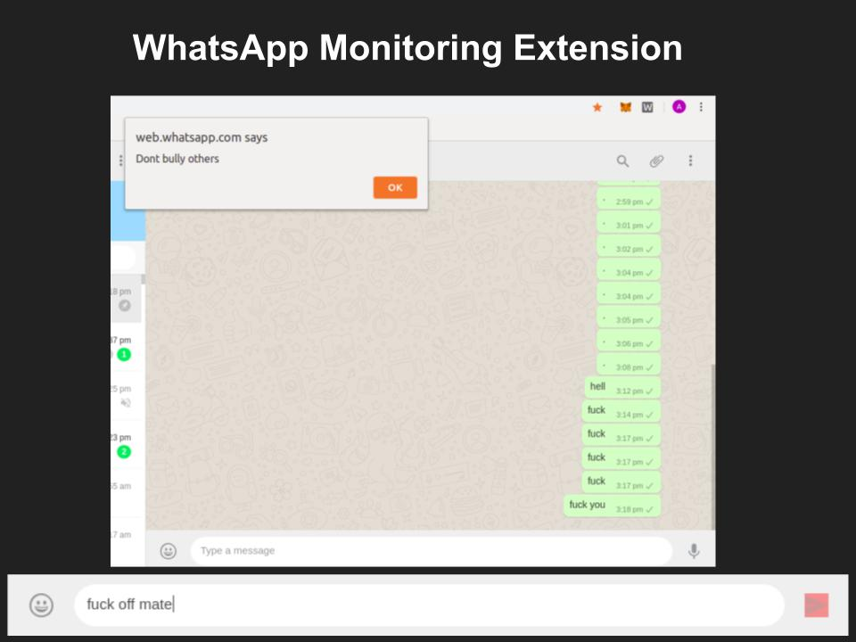

  <h1> WhatsApp-Cyberbully-Detector </h1>

> Kidly view this [link](https://www.howtogeek.com/120743/how-to-install-extensions-from-outside-the-chrome-web-store/) to add custom chrome extension to Webstore

-----------------
 

### Features

- WhatsApp Cyberbully Detectorkeep Extension keeps track of WhatsApp conversations by disabling send message button with a warning if its a foul comment. 

---------------------

### Example

    

 

#### Disclamer

>The texts & images were used in our app for testing purpose only.We don't encourage anybody to use it for crime or cyberbullying.