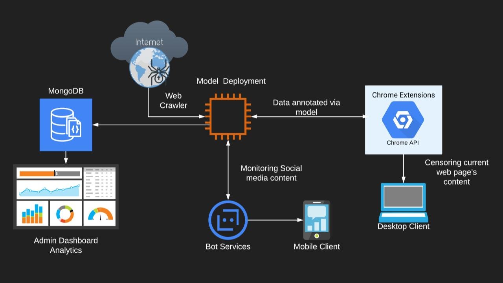

<div align='center'>
  <h1> Bullies-Eye
</div>
<div align='center'>
    
</div>

<div align='center'>

[](www.javascript.com)
[](www.php.net)

</div>

----------------------------------
<div align='center'>

## Features

</div>

- Deploy bots (crawlers) on social media platforms like Twitter, Facebook, Reddit, etc to identify inappropriate posts/comments/images/videos and report them automatically, after issuing certain number of warnings.
These incidents are tracked using our “attention based” transformer model for text and “CNN-LSTM based” model for images / audios / videos.

- An admin dashboard for bot reported cyber-bullying incidents with in-depth analytics. It will send the notifications to the victims, regarding the status of their case.

- The bullying activity on these cases would be further monitored using the dashboard along with an option to auto-generate a report which would be mailed to the authorities.

- A Chrome extension which would hide (for the victims) and highlight (for the admin) bullying content on any web page and keep track of WhatsApp conversations by disabling send message button with a warning if its a foul comment.

- Another bot for chat applications like Telegram to kick out misbehaving members. 

-------------------------
## How to use it

```bash
$ # Get the code
$ git clone https://github.com/mihir2510/BulliesEye.git
$ cd BulliesEye/WebApp
$
$ # Virtualenv modules installation (Unix based systems)
$ virtualenv --no-site-packages env
$ source env/bin/activate
$
$ # Install modules
$ pip3 install -r requirements.txt
$
$ # Set the FLASK_APP environment variable
$ (Unix/Mac) export FLASK_APP=run.py
$
$ # Enable debug (for development)
$ # (Unix/Mac) export FLASK_ENV=development
$
$ # Start the application (development mode)
$ # --host=0.0.0.0 - expose the app on all network interfaces (default 127.0.0.1)
$ # --port=5000    - specify the app port (default 5000)  
$ flask run --host=0.0.0.0 --port=5000
$
$ # Access the dashboard in browser: http://127.0.0.1:5000/
```

For the auto-report generation to work, update the sender's email and password in [routes.py](WebApp/app/home/routes.py)
<br/>

Also, update the SQL engine path in [routes.py](WebApp/app/home/routes.py)
<br/>


<br/>

### Model Details

- Trained custom word embeddings using `word2vec` algorithm on the "hatespeech" dataset from Kaggle
- Model architecture involved,
  
  ```
    Embedding layer
    SpatialDropout
    BiDirectional LSTM
    Conv1D
    GlobalAveragePooling
    Dense
  ```
- After training the model for 5 epochs accuracy of ~97% accuracy was achieved

<br/>

### Scraper Details

- The scraper uses [Tweepy](https://www.tweepy.org/) for scraping tweets from Twitter which is passed into the model to check for abusive content

- Top X most offensive tweets were displayed on admin's dashboard with an option to auto-generate report for each offensive/cyberbullying tweet and mailing to relevant authorities.

- Admin can also search for tweets with specific offensive words.

<br>

### Extension Details 

- Webapp Cyberbully Detector Extension which hides (for the victims) and highlights (for the admin) bullying content on any web page. Content includes **texts & images** and Extension can **Highlight & Redact text , Hide Images**. Chrome Extension can be found [here](https://github.com/mihir2510/BulliesEye/tree/master/Extensions/Web-Cyberbully-Detector)

- WhatsApp Cyberbully Detectorkeep Extension keeps track of WhatsApp conversations by disabling send message button with a warning if its a foul comment. Chrome Extension can be found [here](https://github.com/mihir2510/BulliesEye/tree/master/Extensions/WhatsApp-Cyberbully-Detector)

<br>

### Telegram Bot 

- Telegram Bot to kick out misbehaving members.3 warning are given and the person is kicked out from the group

- It is trained on our Custom model for detecting texts and [Content Moderation API](https://app.nanonets.com/content-moderation-api/) for NSFW images.

<br>

### Use Case
<div align='center'>
    
</div>
<br>

- Data, “crawled” from social media websites viz “the internet” is stored in DB. 
Model classifies these threads/comments as toxic or not.

- These results along with additional features like analytics, topic modelling, report facilities, etc are displayed in the Web UI. 

- “Chrome extension” accesses current web page’s content.This content is sent to the background script, where the model does the classification.

- The “filtered content” is displayed back to the page, in a way preventing the display of explicit content.

<br>

### TODO

- [ ] Implement Transformer architecture
- [ ] Currently its deployed as a Twitter and Telegram Bot, target other platforms like Reddit and Facebook
- [ ] Turn the Dashboard into a PWA 

<br>

### Contributors
- [@KaustubhDamania](https://github.com/KaustubhDamania/)
- [@mihir2510](https://github.com/mihir2510)
- [@anay121](https://github.com/anay121)
- [@2knal](https://github.com/2knal)
- [@vtg2000](https://github.com/vtg2000)
- [@fate2703](https://github.com/fate2703/)

<br>

---
#### Dashboard Credits
[Flask Dashboard AdminLTE](https://appseed.us/admin-dashboards/flask-dashboard-adminlte) - provided by **AppSeed**

<br>

#### Disclamer

>The texts & images were used in our app for testing purpose only.We don't encourage anybody to use it for crime or cyberbullying.