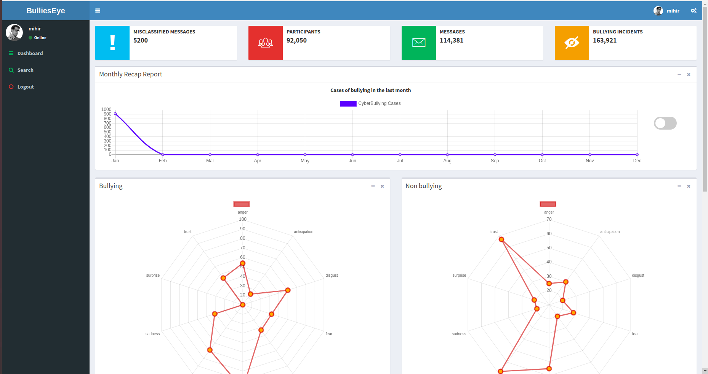
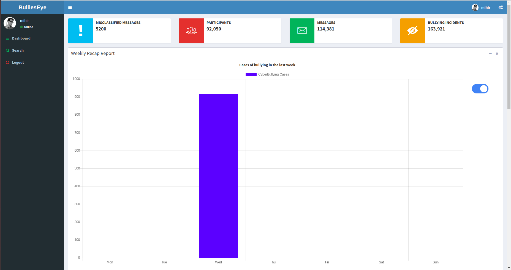
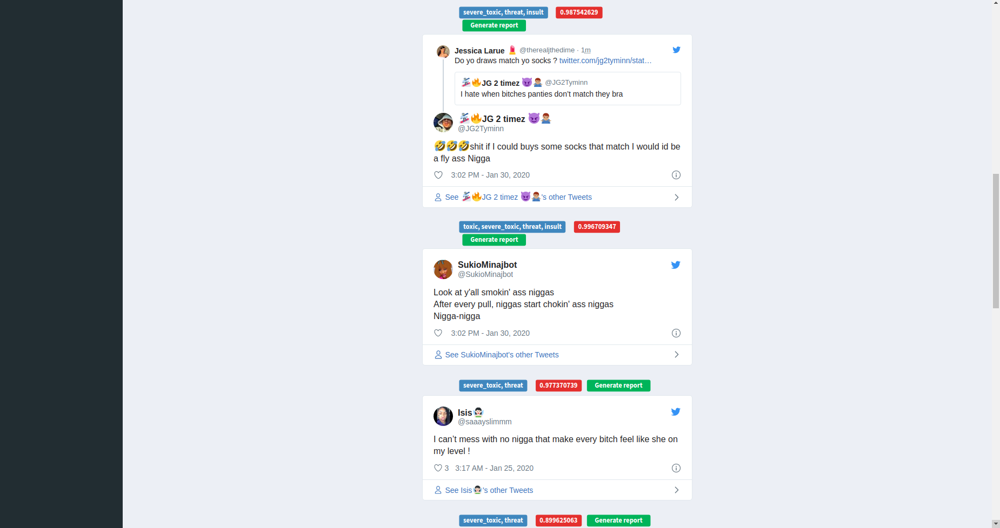
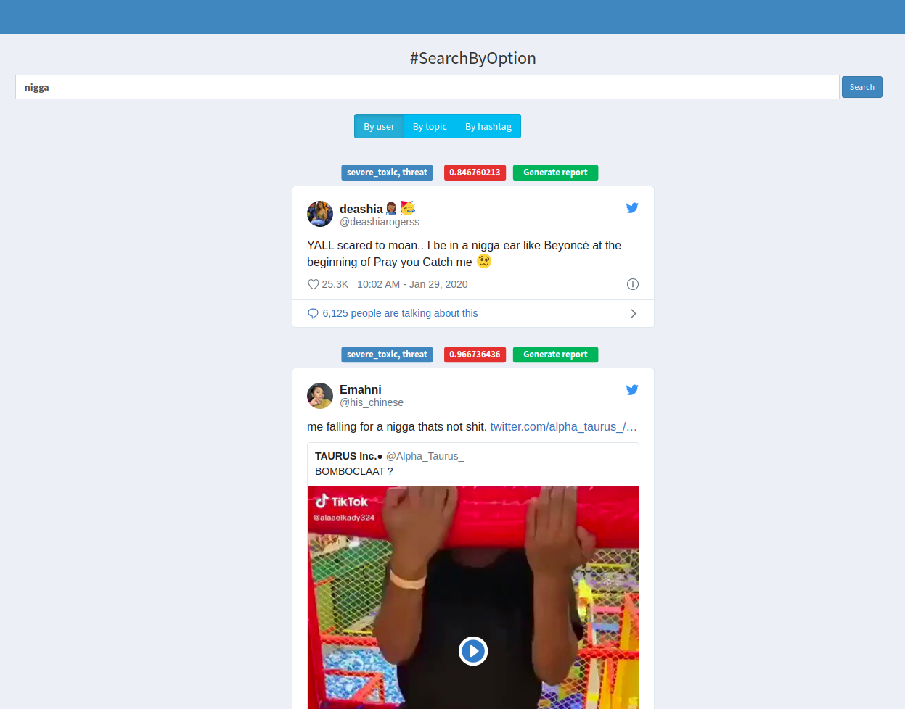
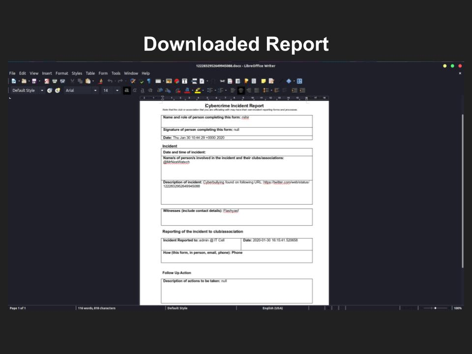

    <h1> Dashboard</h1>

 

    

 

    

 

    

 

    <h1> CyberBully Search</h1>

 

    

 

    

 

    

 

#### Disclamer

>The texts & images were used in our app for testing purpose only.We don't encourage anybody to use it for crime or cyberbullying.